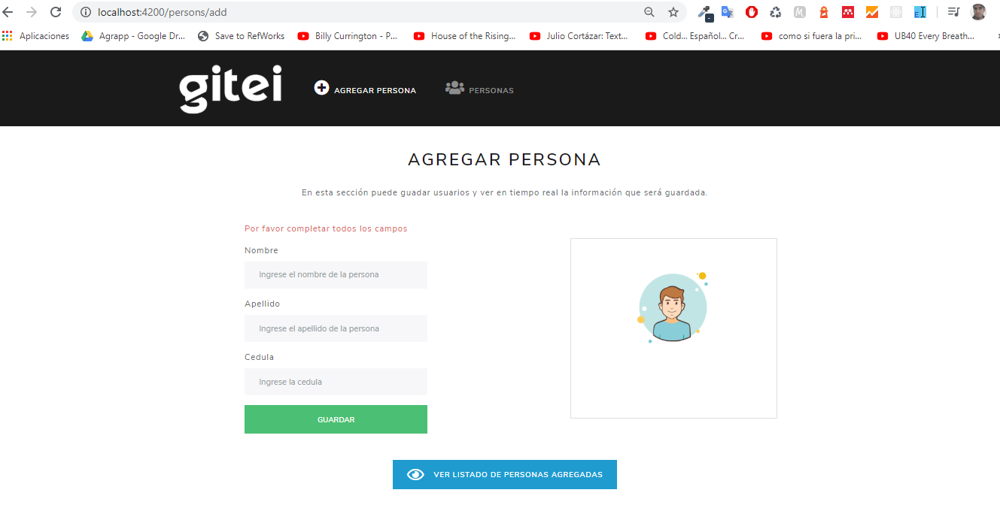

# gitei Project
Este proyecto permite la creación de una base de datos en mysql, la cual se conecta con el servidor que es desarrollado en nodejs, express y sequelize y permiten crear un crud sobre una tabla creada en la base de datos, que finalmente se comunica con el cliente el cual es desarrollado en Angular y bootstrap.

---
## EJECUCIÓN:
**cloninng the project**

1.El proyecto total se encuentra en un solo folder, por ende solo se debe clonar este repositorio en local.

**creating the database**

2. Entrar en el directorio database y copiar el codigo del archivo database.sql, luego correr este codigo en una base de datos relacional para crear la base de datos del proyecto.

**Running the server**

3. Ubicarse en el directorio server y correr el comando npm install y luego correr el comando node server.js

4.Se puede verificar el funcionamiento del servidor en el buscador desde http://localhost:3000/api/personas

**running the client**

5. Ubicarse en el directorio client, correr el comando
npm install y luego correr el comando ng serve

6. Finalmente ejecutar en el buscador el dominio http://localhost:4200/

---
## En Marcha:
Al finalizar la instalación del proyecto, este se debería ver asi:

---
## License & copyright
fredy alexander chaparro castro